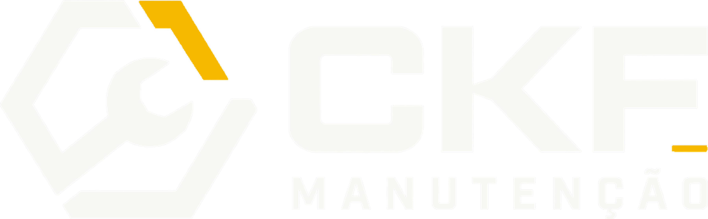

# CKF — Site Institucional

<p align="center">
  
</p>

<p align="center">
  Presença digital da CKF Manutenção: serviços, posicionamento e canais de contato para novos orçamentos.
</p>

<p align="center">
  <a href="https://github.com/Kauerc10/ckf-site-institucional/actions/workflows/ci.yml"></a>
  <a href="https://github.com/Kauerc10/ckf-site-institucional/actions/workflows/security.yml"></a>
  
  
  
</p>

## O site apresenta

- Especialidades da CKF: caminhões e máquinas pesadas, central de concreto, reforma de equipamentos e chassis, e estruturas metálicas.
- Mensagens institucionais, prova de confiança e a jornada de atendimento.
- CTAs de WhatsApp para transformar interesse em pedido de orçamento.
- Layout responsivo com a identidade industrial preto, branco e amarelo da CKF.

## Ecossistema CKF

| Repositório | Responsabilidade |
| --- | --- |
| [CKF Design](https://github.com/Kauerc10/ckf-design) | Fonte oficial da marca, dos assets e das entregas aprovadas |
| **[Site Institucional](https://github.com/Kauerc10/ckf-site-institucional)** | Presença pública e captação de contatos |
| [Sistema de Orçamentos](https://github.com/Kauerc10/ckf-manutencao-orcamentos) | Operação interna, clientes, orçamentos e documentos comerciais |

Assets e decisões de marca devem nascer no repositório de design e chegar ao site por pull request.

## Stack

React 19, Vite 6, React Icons e CSS responsivo. O deploy é configurado para a Vercel, com fallback de SPA, cabeçalhos de segurança e testes de configuração.

## Executar localmente

Requer Node.js 24.

```bash
npm ci
npm run dev
```

## Qualidade e automação

```bash
npm run check:deploy
```

O workflow de CI executa esse mesmo comando em pull requests e na branch `main`; ele valida build, worker e configuração Vercel. O workflow de segurança procura segredos versionados. O Dependabot abre atualizações mensais agrupadas para dependências de produção e desenvolvimento.

## Estrutura

```text
public/assets/  Logo, imagens e ícones públicos
src/            Landing page e estilos
worker/         Fallback de navegação para a SPA
scripts/        Preparação do build para Sites
tests/          Testes do worker e da configuração de deploy
```

## Deploy

A Vercel executa `npm run build` e publica `dist/client`. O arquivo [vercel.json](vercel.json) contém rewrites e cabeçalhos de segurança; não é necessário cadastrar comandos ou pasta de saída manualmente ao importar o projeto.

Antes de publicar, confirme telefones e links de WhatsApp em [src/App.jsx](src/App.jsx).

## Documentação

- [Guia técnico](docs/REPOSITORY_GUIDE.md)
- [Como contribuir](CONTRIBUTING.md)
- [Segurança](SECURITY.md)
- [Suporte](SUPPORT.md)
- [Termos de uso](LICENSE.md)
